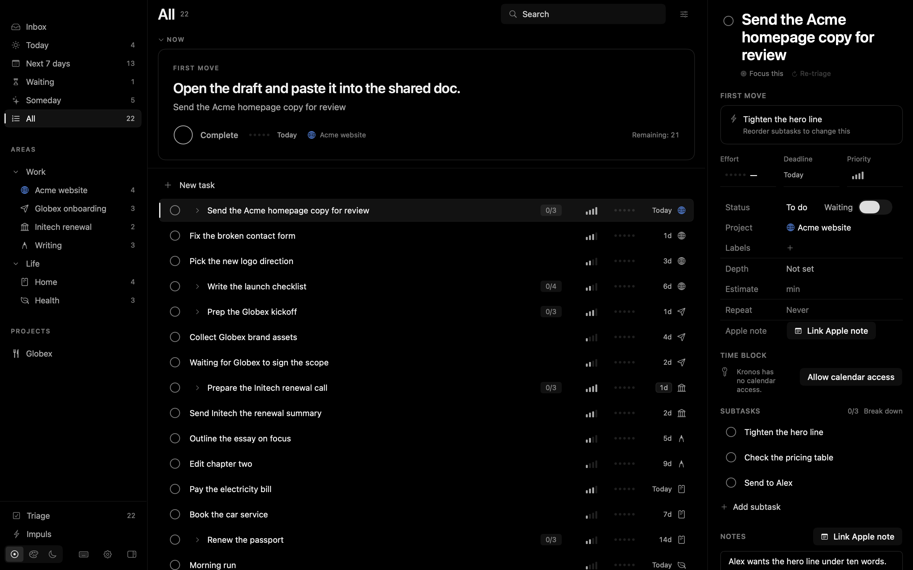
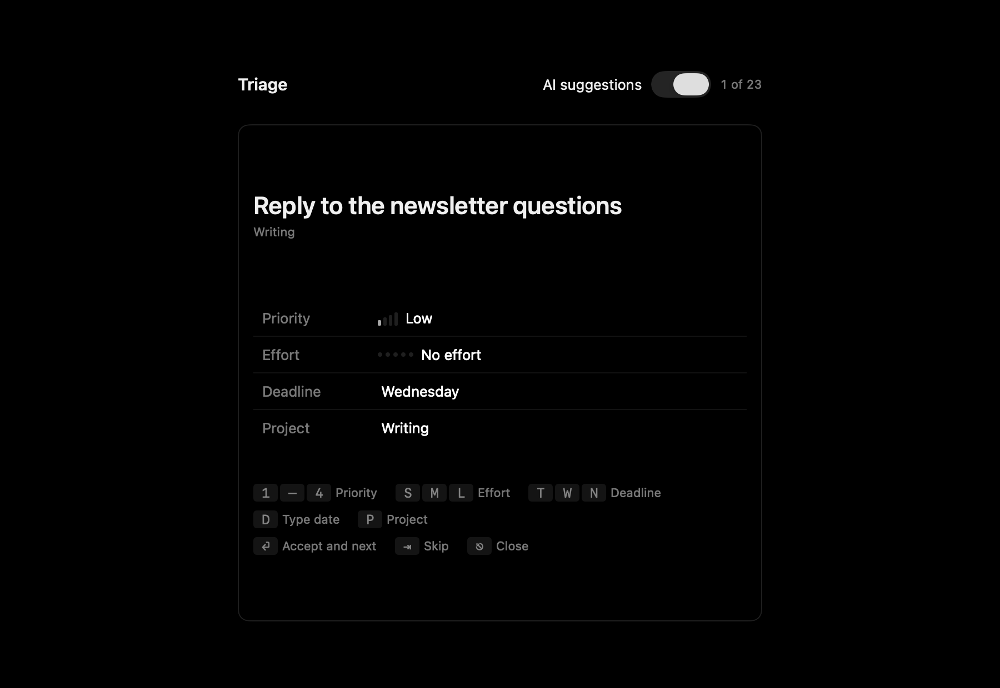
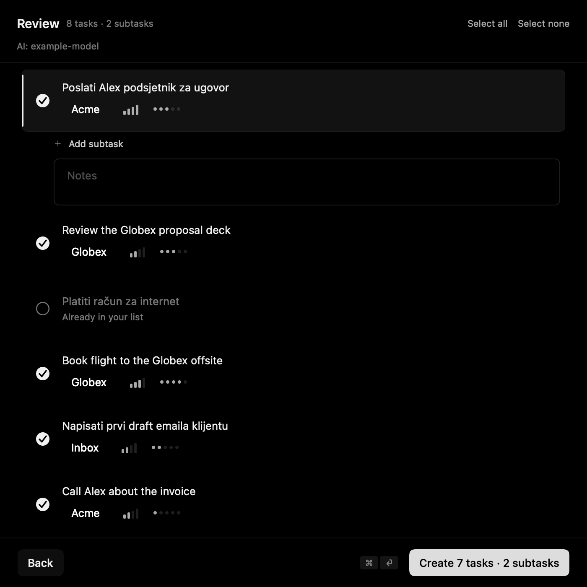
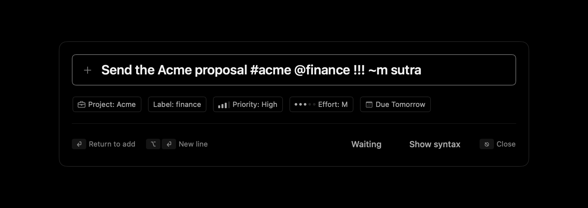
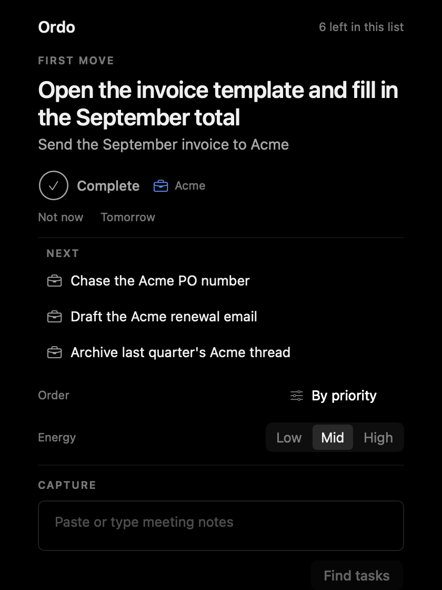

# Kronos

**A native macOS task manager built for ADHD brains.** It shows you the one thing to do next, makes starting it as cheap as possible, and keeps everything on your Mac.



[Download the latest build](https://github.com/marketingbybesic/kronos/releases/latest) · macOS 14 or later · Apple silicon and Intel · Apache-2.0

---

## Why it exists

Most task apps are built for people who can look at a list of forty things and simply begin. If starting is the hard part, a long list is the problem, not the solution. Kronos is designed around **low initiation energy**:

- **One next thing.** The Now card shows a single task and its **first move**: the first physical action, small enough to start without deciding anything.
- **Ordo.** A fixed order for today, so "what now?" is already answered. Skip, snooze or finish; the next one slides in.
- **Triage in seconds.** One task at a time, number keys for priority, a letter for effort, a typed date. Suggestions are pre-filled; you accept or change them and move on.
- **Undated means Someday.** A task without a deadline leaves today's view automatically. Give it a date and it comes back.
- **Impuls.** "I have twenty minutes and low energy": Kronos picks something that fits.

## Features

| | |
|---|---|
| **Quick add from anywhere** (⌃⌥K) | `Call Alex tomorrow !!! ** #acme` sets the date, priority, effort and project as you type. Dates in plain English and Croatian (`next month`, `by friday`, `za tjedan dana`, `do petka`), typo-tolerant, plus the date words of your macOS languages. `Task > subtask > subtask` creates the outline in one line. |
| **Capture from notes** (⇧⌘N) | Paste meeting notes or a brain dump. Kronos splits it into tasks, subtasks and notes on the spot; with AI on, it also estimates priority and effort. A guard rejects anything the model invents that is not in your text. |
| **Triage** (⌥⌘T) | Keyboard-first review of whatever still lacks a priority, effort, deadline or project. |
| **Time blocks** | Follows your calendar: the block you are in decides which tasks the menu bar offers. |
| **Menu bar** | The current task, "Not now" and "Tomorrow", without opening the window. |
| **Apple Notes** | Link a note to a task and open it from the inspector. |
| **Siri and Shortcuts** | Add a Task, What's Next, Complete Current Task, Capture Notes, Start Impuls, Pin Focus Task, Switch Ordo Preset. |
| **Spotlight** | Your tasks are searchable system-wide. |
| **AI agents (MCP)** | An optional local MCP server lets tools such as Claude Code read and update your tasks. Off by default, loopback only, token protected. |
| **Look** | True-black OLED interface, three colour modes, custom accent, three text sizes. English and Croatian. |

<p>


</p>
<p>


</p>

## Privacy

Kronos is **local-first**. Your tasks live in a database in `~/Library/Application Support/Kronos` and nowhere else. There is no account, no analytics and no server of ours.

AI is optional and **bring-your-own-key**. With AI off, nothing leaves your Mac. With AI on, only the text of the task or note you act on is sent to the provider **you** configured, and keys are stored in your macOS Keychain. The MCP server is off until you enable it and only listens on `127.0.0.1`.

## Install

1. Download `Kronos-<version>.dmg` from [Releases](https://github.com/marketingbybesic/kronos/releases/latest), open it and drag **Kronos** to **Applications**.
2. **First launch.** This build is not notarised by Apple yet (that needs a paid Developer ID, which is on the roadmap), so macOS will refuse to open it the first time. Open **System Settings > Privacy & Security**, scroll to the message about Kronos and click **Open Anyway**. You only do this once per version. If you prefer the terminal: `xattr -dr com.apple.quarantine /Applications/Kronos.app`.
3. Kronos asks for a permission only when you first use the feature that needs it (Calendar for time blocks, Automation for Apple Notes).

If you would rather not run an unnotarised binary, build it yourself: it takes two commands.

## Build from source

Requirements: macOS 14+, a recent Xcode (developed and tested with Xcode 27), [XcodeGen](https://github.com/yonaskolb/XcodeGen) (`brew install xcodegen`).

```sh
git clone https://github.com/marketingbybesic/kronos.git && cd kronos
xcodegen generate
xcodebuild -scheme Kronos -configuration Release -derivedDataPath build build
open build/Build/Products/Release/Kronos.app
```

The project signs ad hoc by default, so it builds without an Apple Developer account. To sign with your own identity, copy `Local.xcconfig.example` to `Local.xcconfig` and set it there; that file is ignored by git.

Tests for the core library: `cd Packages/KronosCore && swift test`.

## AI setup (optional)

**Settings > AI**: pick a provider (OpenRouter, GhostCLI, or any OpenAI-compatible endpoint under *Custom*), paste your key, choose a model. Free OpenRouter models are enough for triage and capture. Kronos tries a second model when the first one returns nothing usable, and always shows what happened: *Asking…*, *AI: model*, or *AI failed: reason*, with the plain, non-AI result already on screen.

## AI agents (MCP)

**Settings > AI access (MCP)**: turn it on and copy the snippet for your client. Tools: `list_tasks`, `get_task`, `create_task`, `update_task`, `complete_task`, `delete_task`, `restore_task`, `add_subtask`, `toggle_subtask`, `ordo_get`, `ordo_set`, `rules_list`, `rules_add`. Calls never bring the app to the front.

## Architecture

SwiftUI + AppKit app over **KronosCore**, a Swift package with the model (SwiftData), parsing, ranking, recurrence, import/export, the AI layer and the MCP dispatcher. The core has no UI dependency and is covered by 500+ tests. Two small dependencies: [KeyboardShortcuts](https://github.com/sindresorhus/KeyboardShortcuts) and [swift-markdown-ui](https://github.com/gonzalezreal/swift-markdown-ui).

## Roadmap

- Notarised builds (Developer ID)
- iCloud sync (the data model is already CloudKit-compatible; sync is switched off until it can be done properly)
- iPhone, Apple Watch and Apple Vision Pro apps on the same data

## Contributing

Issues and pull requests are welcome: see [CONTRIBUTING.md](CONTRIBUTING.md). Security reports: [SECURITY.md](SECURITY.md).

## License

[Apache License 2.0](LICENSE). Copyright 2026 Marketing by Bešić. See [NOTICE](NOTICE) for third-party components.
